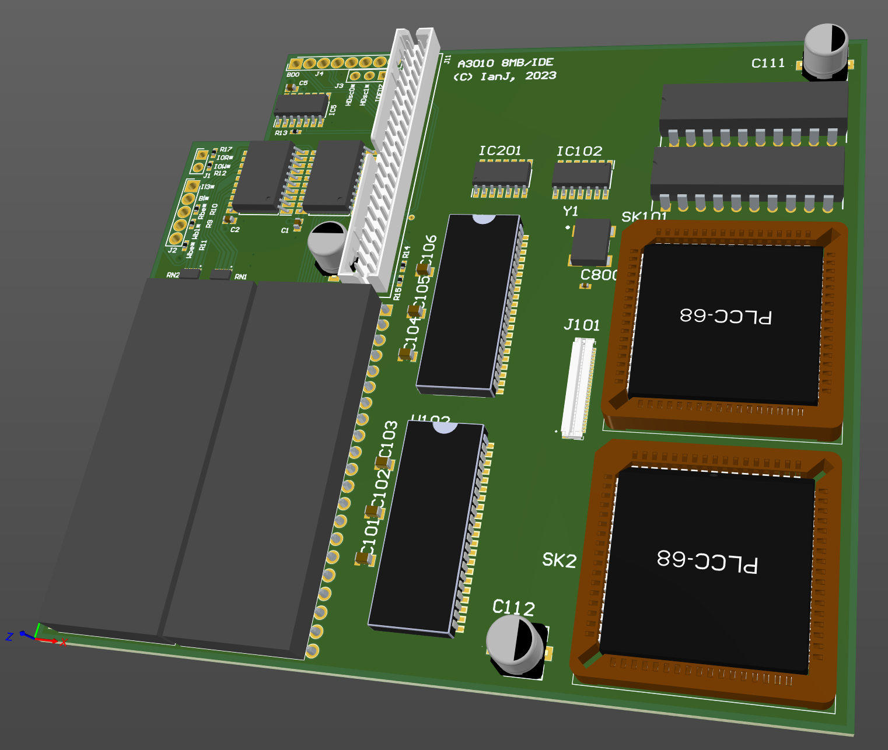

# Acorn A3010 'Adelaide' 8MB/IDE interface

April 2023

This is a 'combo' project which combines my implementation of the 'Vectorlight' A3010 IDE interface and A3010 4MB RAM, and extends it as an 8MB solution.

This replaces the 1MB onboard RAM, and instead places the RAM and both MEMCs on a single PCB with the ROMs and IDE interfacing.

The project only applies to the 'Adelaide' version of the A3010, with the Heron daughtercard, rather than the standard A3010 with Arm250 SOC -- this is because only the 'Heron' card allows replacement of the MEMC.

The original MEMC is replaced by a small PCB which routes the MEMC control signals to the new board - see the MEMC_FFC project.

This design is incomplete - barely started at this point.

## Licence

No warranty is provided, and this work is used at your own risk.  

Licenced as CC BY-SA 3.0

Copyright 2023 Ian Jeffray

